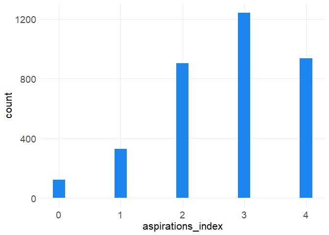

South Sudan Resilience
================
Oct 2021

-   [GitHub Documents](#github-documents)
-   [Including Code](#including-code)
-   [Including Plots](#including-plots)

    toc_float: true
    number_sections: true
    theme: paper
    fig.caption: true
    df_print: kable
    code_folding: true

``` r
describe(dat$aspirations_index)
```

          ┌──────────────────────────────────────────────────────────
          │ vars          n   mean     sd   median   trimmed    mad  
          ├──────────────────────────────────────────────────────────
          │    1   3.53e+03   2.72   1.06        3      2.82   1.48  
          └──────────────────────────────────────────────────────────

Column names: vars, n, mean, sd, median, trimmed, mad, min, max, range,
skew, kurtosis, se

7/13 columns shown.

``` r
ggplot(dat, aes(aspirations_index)) + 
  geom_bar(width=.2, fill="dodgerblue2")
```

<!-- -->

## GitHub Documents

This is an R Markdown format used for publishing markdown documents to
GitHub. When you click the **Knit** button all R code chunks are run and
a markdown file (.md) suitable for publishing to GitHub is generated.

## Including Code

You can include R code in the document as follows:

``` r
summary(cars)
```

    ##      speed           dist    
    ##  Min.   : 4.0   Min.   :  2  
    ##  1st Qu.:12.0   1st Qu.: 26  
    ##  Median :15.0   Median : 36  
    ##  Mean   :15.4   Mean   : 43  
    ##  3rd Qu.:19.0   3rd Qu.: 56  
    ##  Max.   :25.0   Max.   :120

## Including Plots

You can also embed plots, for example:

<!-- -->

Note that the `echo = FALSE` parameter was added to the code chunk to
prevent printing of the R code that generated the plot.
